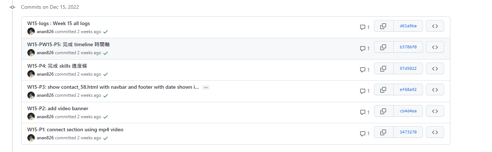
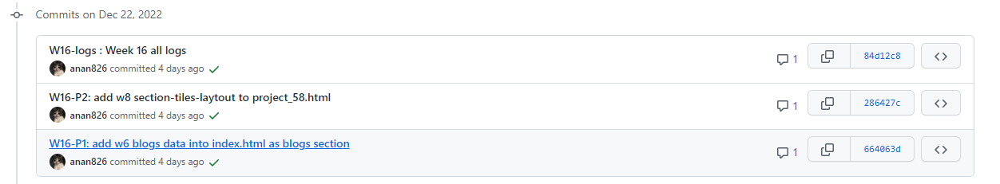

### Github repo url

[My github repo](https://github.com/anan826/project.git)
[My vercel](project-9gv4cwm9w-anan826.vercel.app)

##我另外做了一個 project 存放這些資料，主要是因為擔心期末 project 的檔案會跟平常上課的內容搞混

## week 11 git logs

## week 12 git logs

## week 13 git logs

## week 14 git logs

## week 15 git logs

## week 16 git logs

## INDEX

## DEMO

## WORKS

## RESUME

## LEARNING

## 問題

## 架構

## 我覺得我最大的問題在於架構的部分，一來是我覺得我對於設計這種事情一直很沒有概念，我有想法但我不擅長將事情完整的表達或是展現出來，即使這樣我還是抱著熱忱去學習如何製作一個網頁，也有寫了一個屬於自己的網頁。

## 自我學習

## 介面設計

## 這次的 project 我的 navbar 基本上都是使用 portfolio 的，比較不一樣的是左上角的 logo 我換掉了，每個頁面都有不同的方式，再來是 resume 的部分，我也是直接套用 portfolio 的架構，最主要的原因是因為我原本就很喜歡這種風格，我很喜歡這種商業型的頁面，簡潔且明瞭。

## 學習心得

## 感想

## 我覺得我寫網頁時的動力完完全全來自於成就感，當我在課堂實作的時候準確做出上課所需的內容所給我的成就感是不可言喻的，對於一個初學程式的我來說，是一個非常正向的幫助，也促使我嘗試創作屬於一個自己的網頁。
