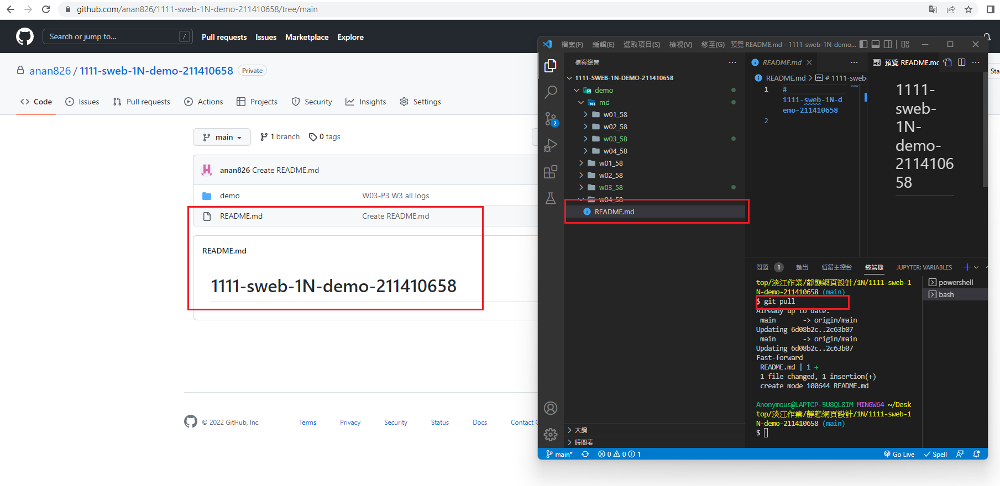
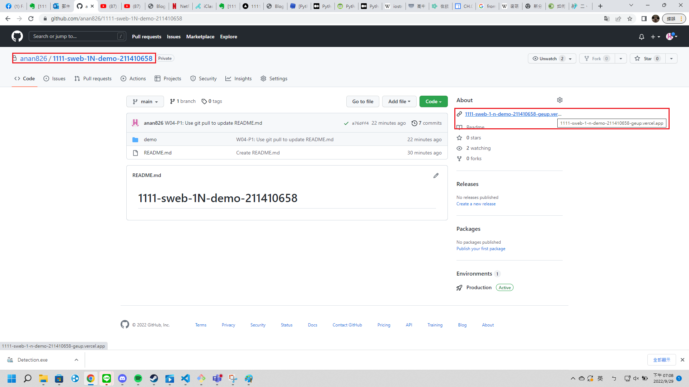
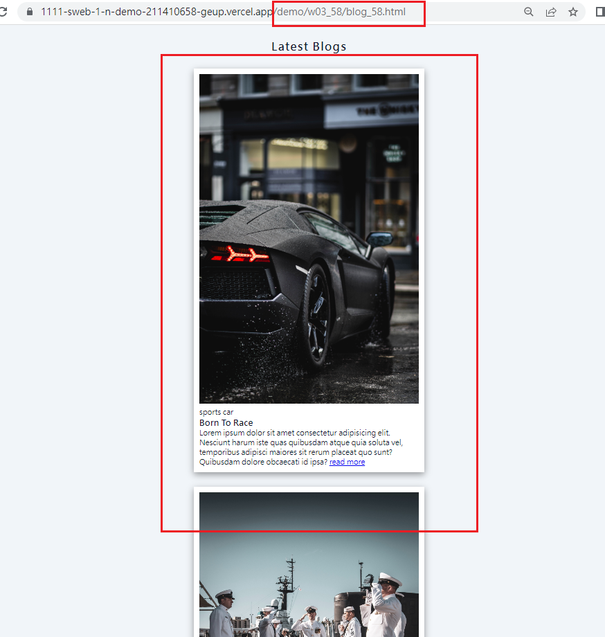
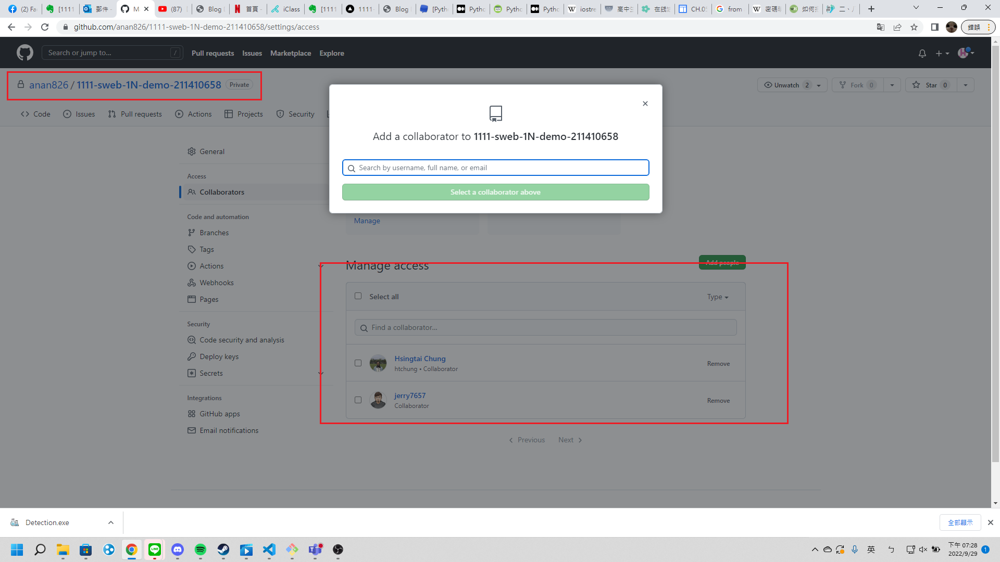
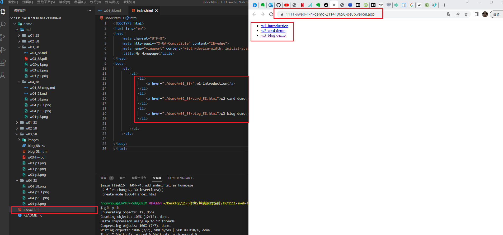
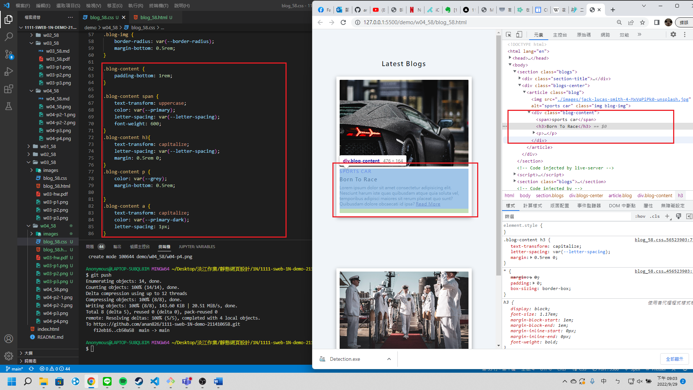
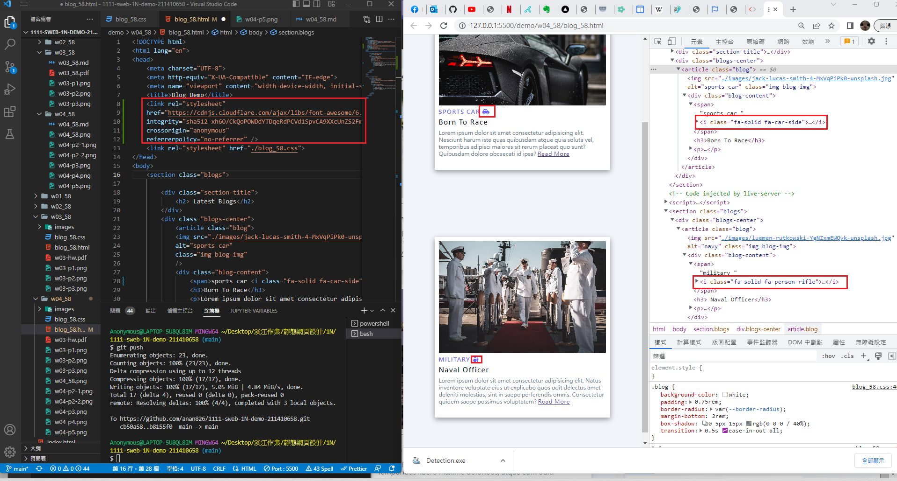
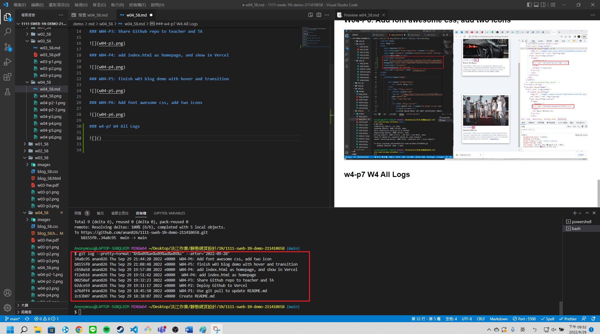

### Github repo url

[My github repo](https://github.com/anan826/1111-sweb-1N-demo-211410658.git)

### W04-P1: Use git pull to update README.md



### W04-P2: Deploy Github to Vercel




### W04-P3: Share Github repo to teacher and TA



### W04-P4: add index.html as homepage, and show in Vercel



### W04-P5: finish w03 blog demo with hover and transition



### W04-P6: Add font awesome css, add two icons



### w4-p7 W4 All Logs



```
$ git log --pretty=format:"%h%x09%an%x09%ad%x09%s" --after="2022-09-28"
34a8c95 anan826 Thu Sep 29 21:44:20 2022 +0800  W04-P6: Add font awesome css, add two icon
b8155f0 anan826 Thu Sep 29 21:08:48 2022 +0800  W04-P5: finish w03 blog demo with hover and transition
cb50a58 anan826 Thu Sep 29 19:57:08 2022 +0800  W04-P4: add index.html as homepage, and show in Vercel
f12eb16 anan826 Thu Sep 29 19:51:42 2022 +0800   W04-P4: add index.html as homepage
00250af anan826 Thu Sep 29 19:32:23 2022 +0800  W04-P3: Share Github repo to teacher and TA
62dce59 anan826 Thu Sep 29 19:11:17 2022 +0800  W04-P2: Deploy Github to Vercel
a76dff4 anan826 Thu Sep 29 18:45:50 2022 +0800  W04-P1: Use git pull to update README.md
2c63b07 anan826 Thu Sep 29 18:38:07 2022 +0800  Create README.md
```
