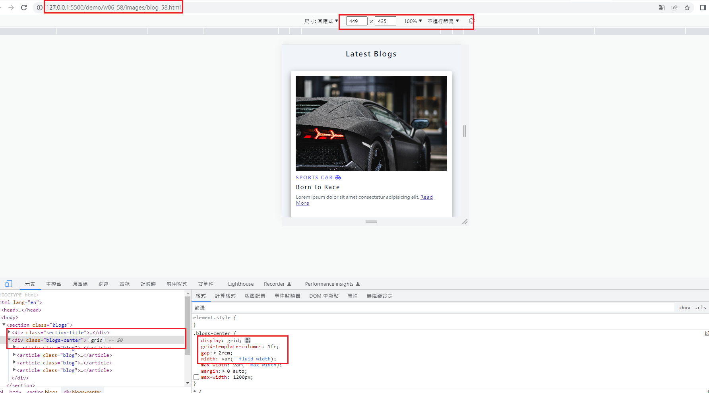
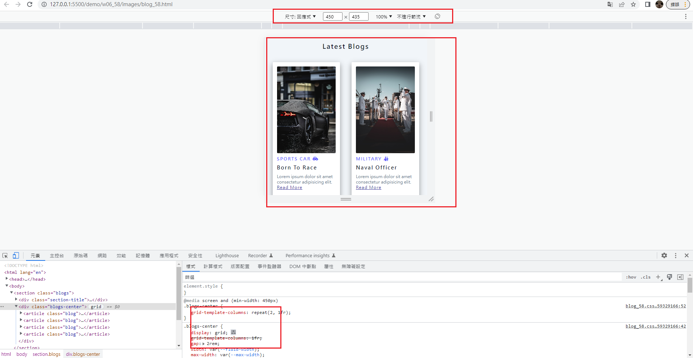
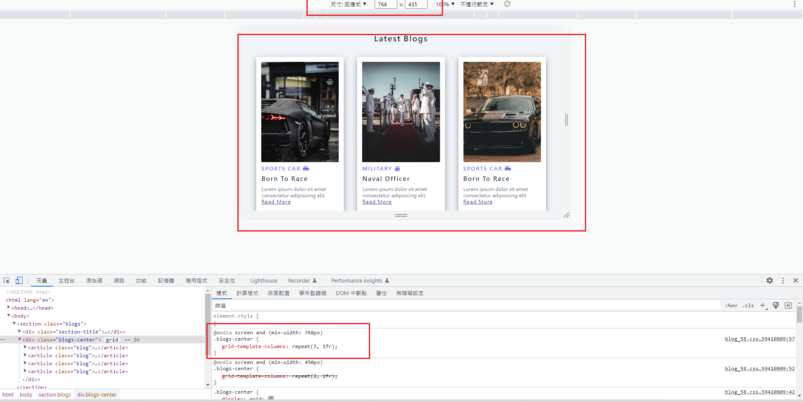
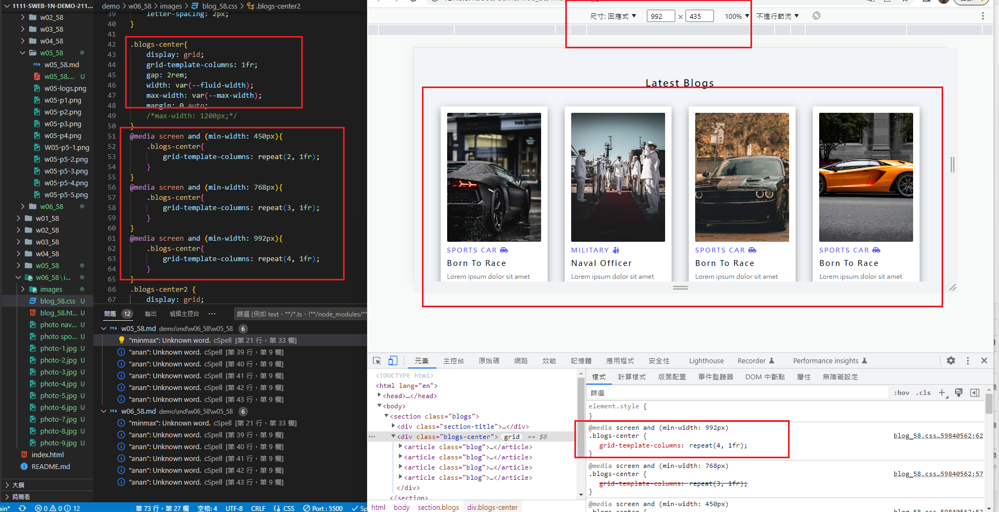
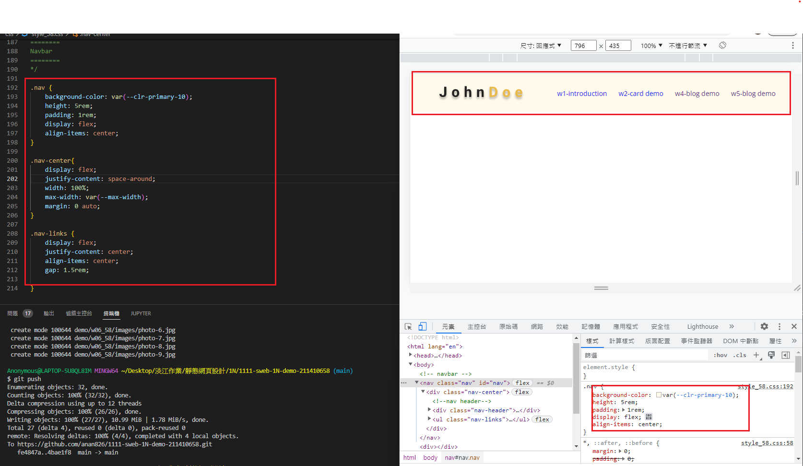
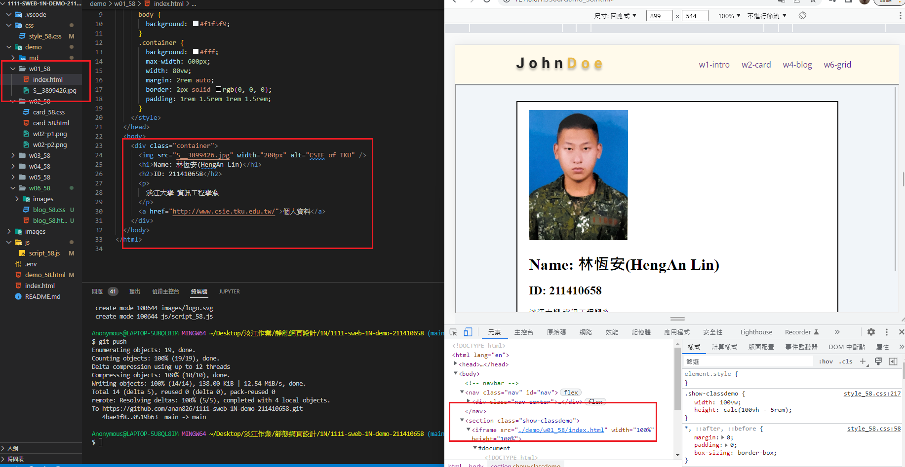
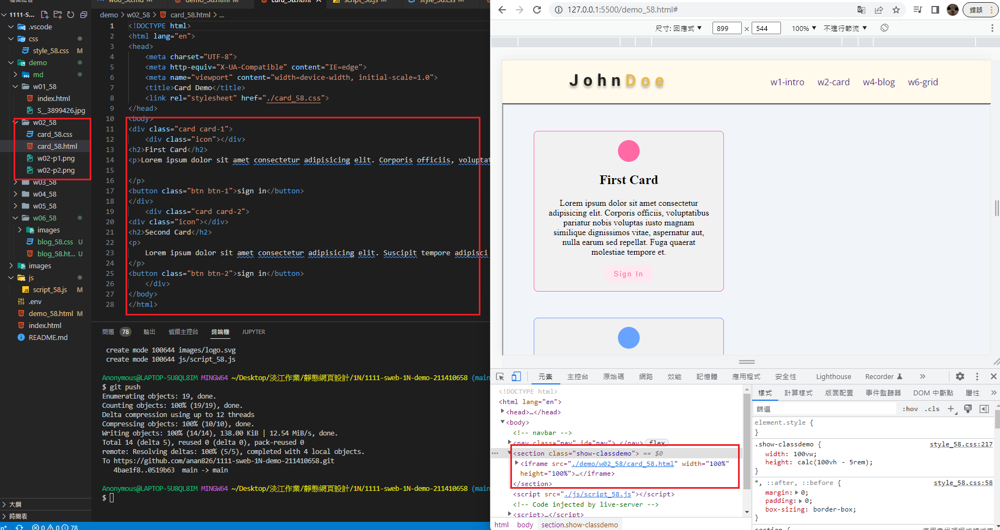
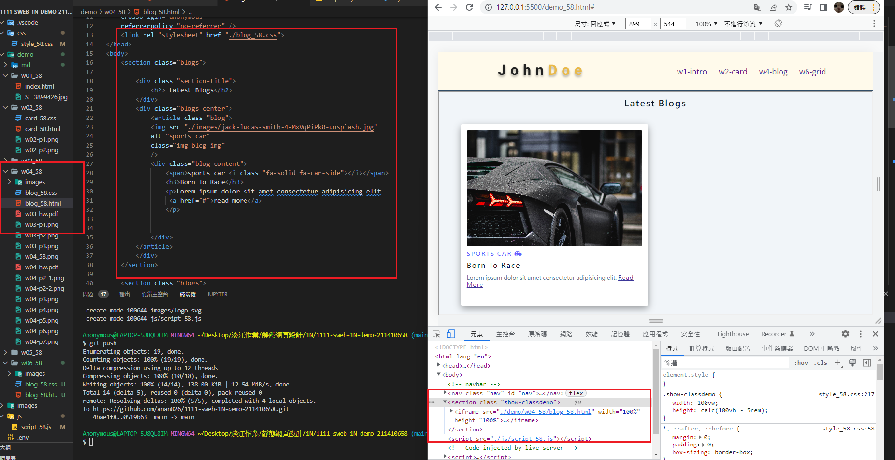
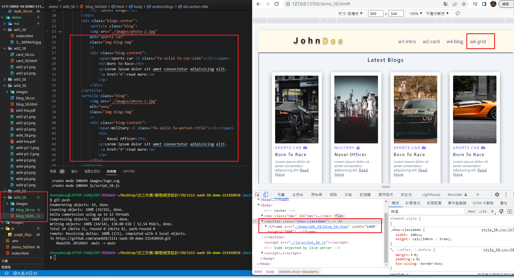
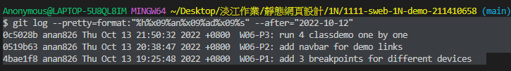

### Github repo url

[My github repo](https://github.com/anan826/1111-sweb-1N-demo-211410658.git)

### W06-P1: add 3 breakpoints for different devices









### W06-P2: add navbar for demo links



### W06-P3: run 4 classdemo one by one









### W06-logs: W6 all logs



```
$ git log --pretty=format:"%h%x09%an%x09%ad%x09%s" --after="2022-10-12"
0c5028b anan826 Thu Oct 13 21:50:32 2022 +0800  W06-P3: run 4 classdemo one by one
0519b63 anan826 Thu Oct 13 20:38:47 2022 +0800  W06-P2: add navbar for demo links
4bae1f8 anan826 Thu Oct 13 19:25:48 2022 +0800  W06-P1: add 3 breakpoints for different devices
```
