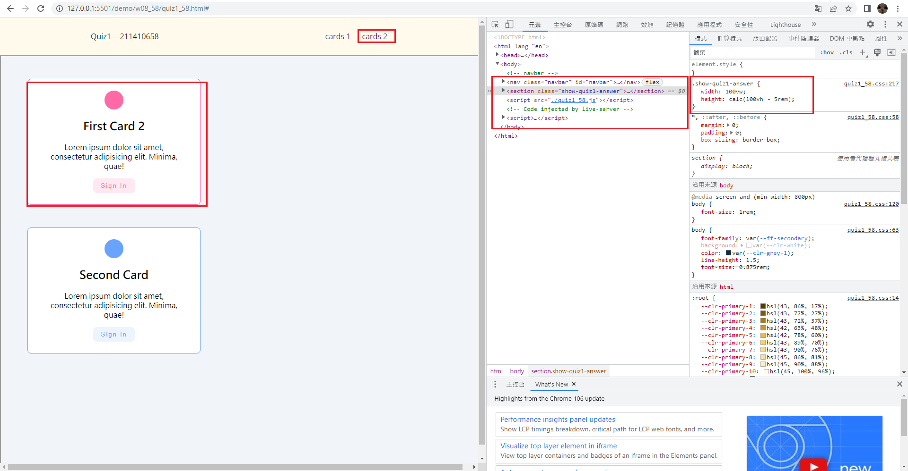
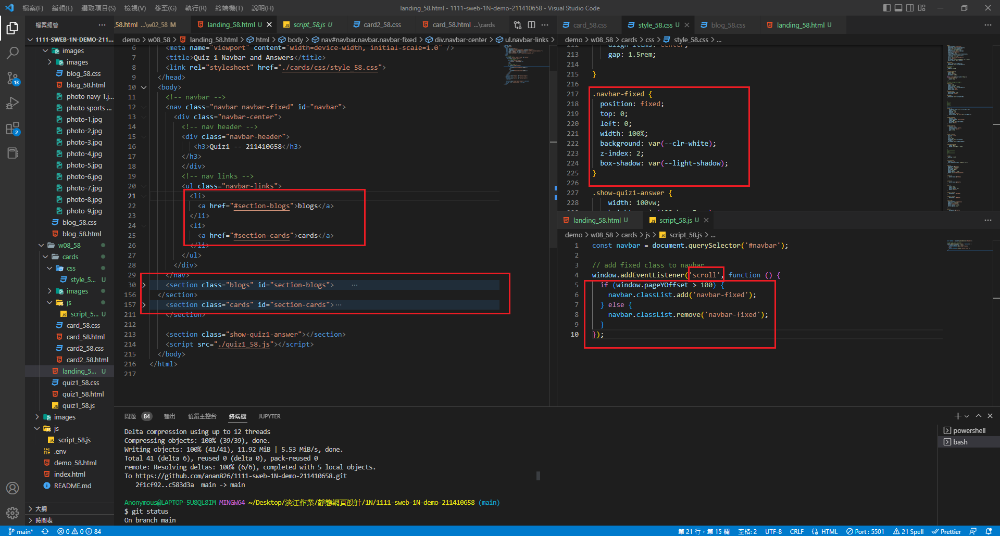
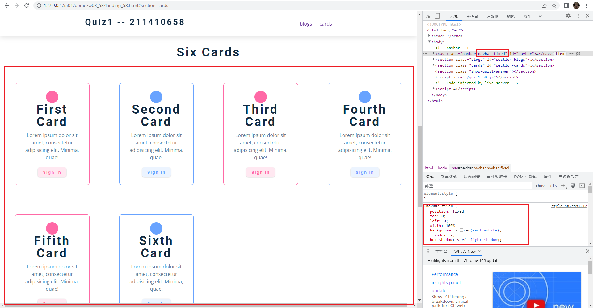
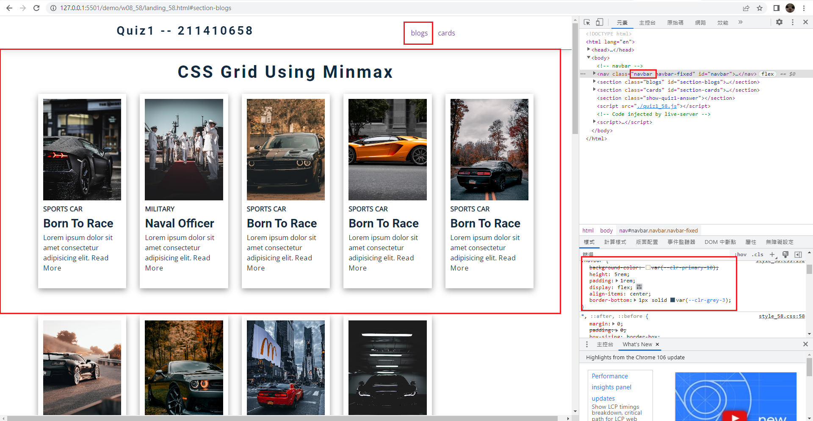
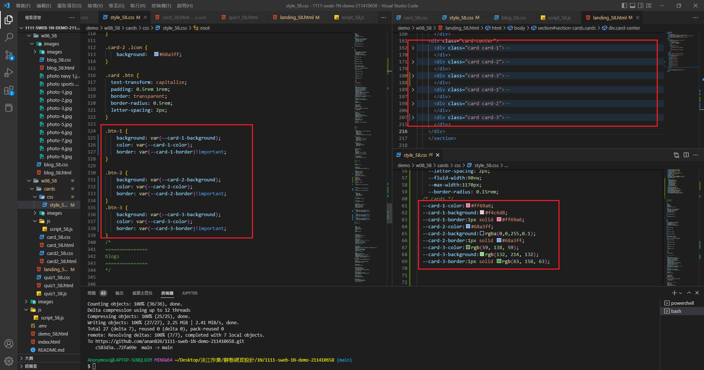

### Github repo url

[My github repo](https://github.com/anan826/1111-sweb-1N-demo-211410658.git)

### w08-P1: navbar with card1 and card2




### w08-P2: fixed navbar setup and two sections with two links







### w08-P3: define css variables for .btn-1, .btn-2, .btn3




### w08-P4: w08 logs

```
$ git log --pretty=format:"%h%x09%an%x09%ad%x09%s" --after="2022-10-26"
b99f579 anan826 Thu Oct 27 21:48:46 2022 +0800  w08-P3: define css variables for .btn-1, .btn-2, .btn3
72fa69e anan826 Thu Oct 27 21:01:50 2022 +0800  w08-P2: fixed navbar setup and two sections with two links
c583d3a anan826 Thu Oct 27 19:09:35 2022 +0800  w08-P1: navbar with card1 and card2
```
