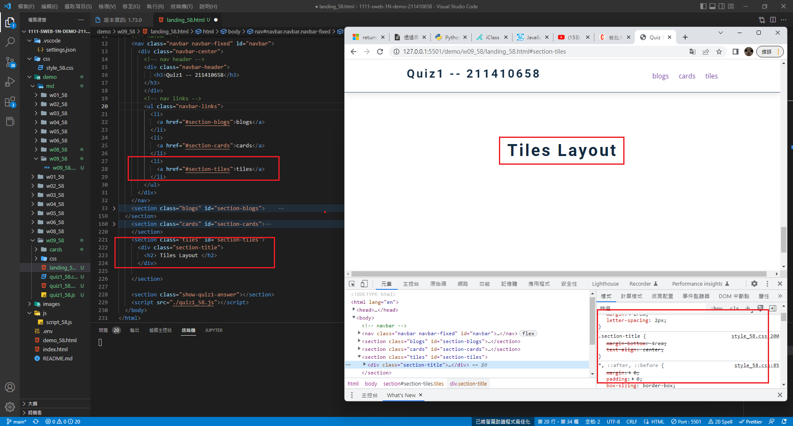
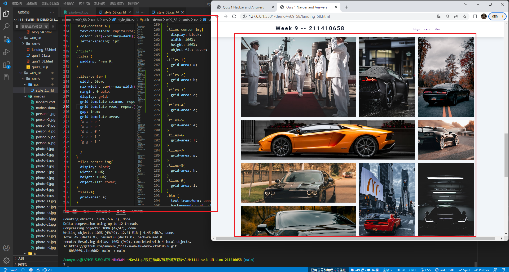
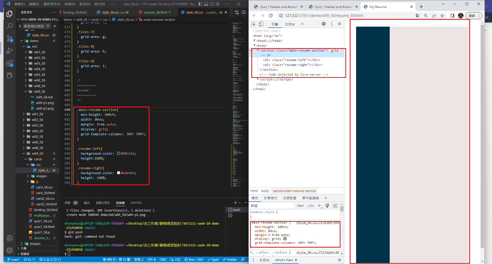
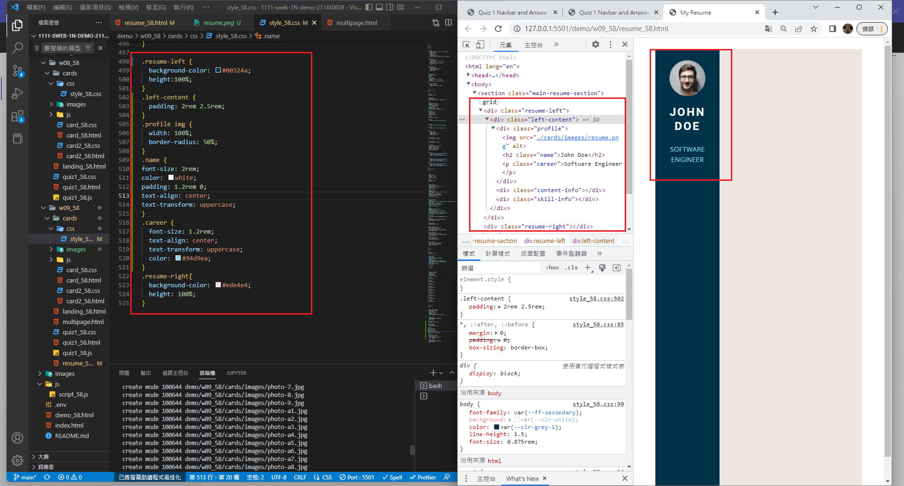
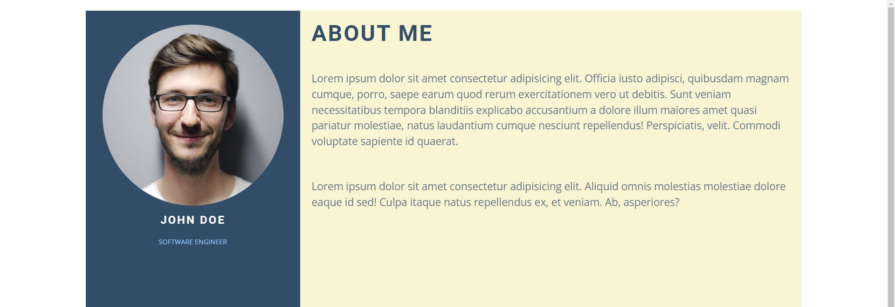

### Github repo url

[My github repo](https://github.com/anan826/1111-sweb-1N-demo-211410658.git)

### w09-P1: setup tiles menu item with section id



### w09-P2: Show tiles layout of 9 photos



### W09-P3: Resume, show resume-left and resume-right with ratio 30:70



### w09-P4: Resume, show .profile with photo, name, career



### w09-P5: Resume, show about info on resume-right section



### w09-logs: w09 logs

```
$ git log --pretty=format:"%h%x09%an%x09%ad%x09%s" --after="2022-11-02"
0c6703e anan826 Thu Nov 3 21:34:49 2022 +0800 w09-P5: Resume, show about info on resume-right section
dad2420 anan826 Thu Nov 3 20:12:42 2022 +0800 W09-P3: Resume, show resume-left and resume-right with ratio 30:70
c6d87bc anan826 Thu Nov 3 19:53:06 2022 +0800 w09-P2: Show tiles layout of 9 photos
1bc6d62 anan826 Thu Nov 3 18:51:01 2022 +0800 w09-P1: setup tiles menu item with section id
```
