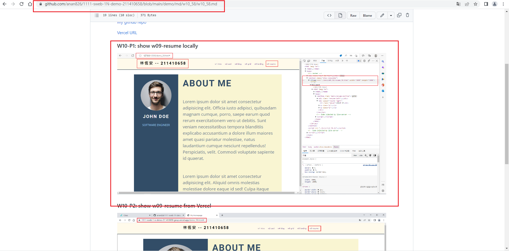
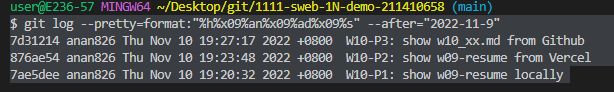

### Github repo & Vercel url

[My github repo](https://github.com/anan826/1111-sweb-1N-demo-211410658.git)

[Vercel URL](https://1111-web-demo-id-kd9e.vercel.app/)

### W10-P1: show w09-resume locally


### W10-P2: show w09-resume from Vercel


### W10-P3: show w10_xx.md from Github



### W10-logs: show all logs of Week 9


```
$ git log --pretty=format:"%h%x09%an%x09%ad%x09%s" --after="2022-11-9"
7d31214 anan826 Thu Nov 10 19:27:17 2022 +0800  W10-P3: show w10_xx.md from Github
876ae54 anan826 Thu Nov 10 19:23:48 2022 +0800  W10-P2: show w09-resume from Vercel
7ae5dee anan826 Thu Nov 10 19:20:32 2022 +0800  W10-P1: show w09-resume locally

```