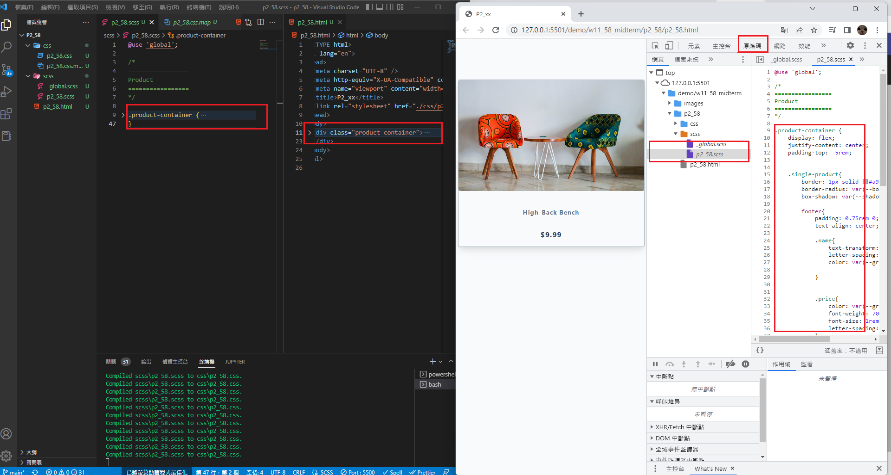
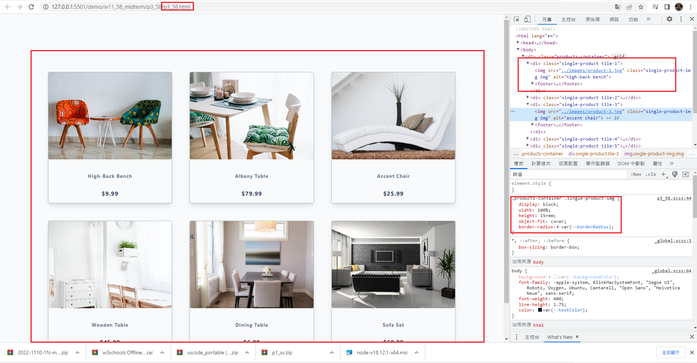
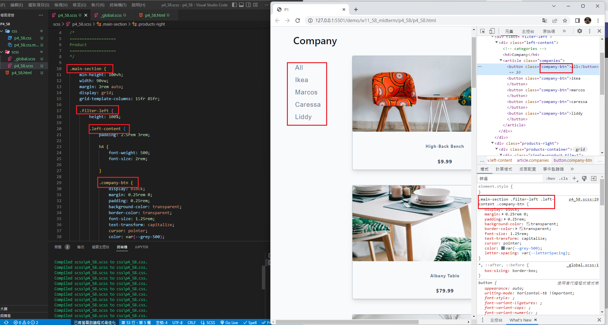
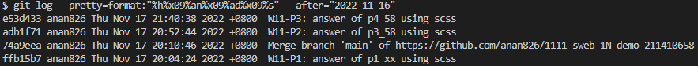

### Github repo url

[My github repo](https://github.com/anan826/1111-sweb-1N-demo-211410658.git)

### W11-P1: answer of p2_58 using scss



### W11-P2: answer of p3_58 using scss



### W11-P3: answer of p4_58 using scss



### W11-logs: show all logs of Week 11



```
$ git log --pretty=format:"%h%x09%an%x09%ad%x09%s" --after="2022-11-16"
e53d433 anan826 Thu Nov 17 21:40:38 2022 +0800  W11-P3: answer of p4_58 using scss
adb1f71 anan826 Thu Nov 17 20:52:44 2022 +0800  W11-P2: answer of p3_58 using scss
74a9eea anan826 Thu Nov 17 20:10:46 2022 +0800  Merge branch 'main' of https://github.com/anan826/1111-sweb-1N-demo-211410658
ffb15b7 anan826 Thu Nov 17 20:04:24 2022 +0800  W11-P1: answer of p1_xx using scss
```
