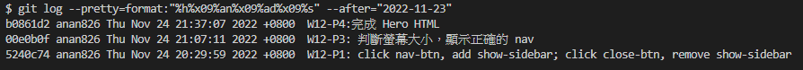

### Github repo url

[My github repo](https://github.com/anan826/1111-sweb-1N-demo-211410658.git)

### W12-P1: click nav-btn, add show-sidebar; click close-btn, remove show-sidebar


### W12-P2: finish sidebar with social icons


### W12-P3: 判斷螢幕大小，顯示正確的 nav


### W12-P4:完成 Hero HTML


### W12-P5: git log



```
git log --pretty=format:"%h%x09%an%x09%ad%x09%s" --after="2022-11-16"
b0861d2 anan826 Thu Nov 24 21:37:07 2022 +0800  W12-P4:完成 Hero HTML
00e0b0f anan826 Thu Nov 24 21:07:11 2022 +0800  W12-P3: 判斷螢幕大小，顯示正確的 nav
5240c74 anan826 Thu Nov 24 20:29:59 2022 +0800  W12-P1: click nav-btn, add show-sidebar; click close-btn, remove show-sidebar
```
