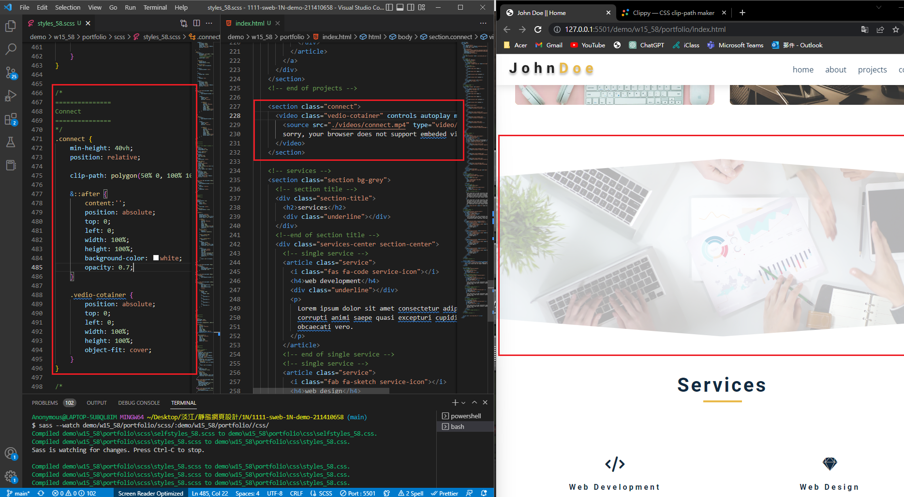
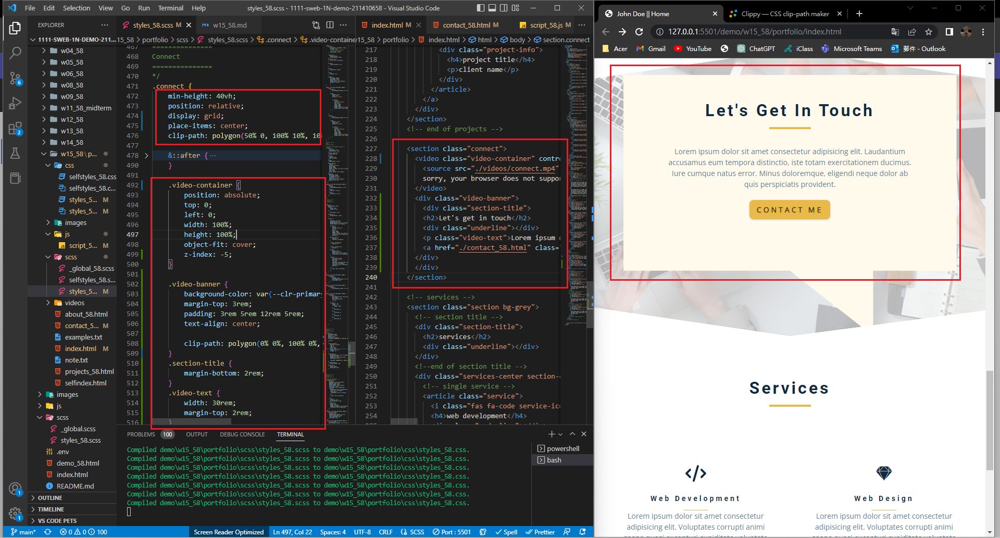
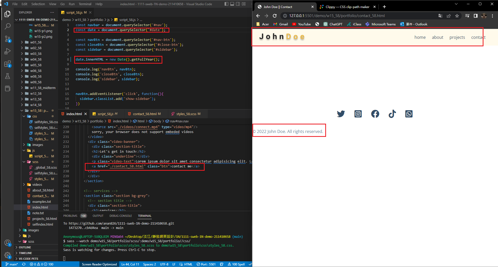
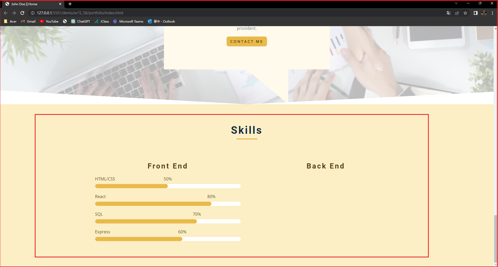
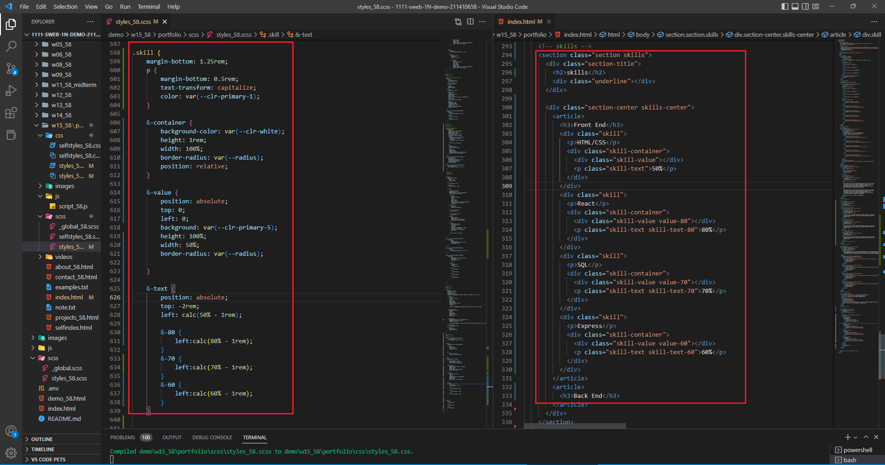
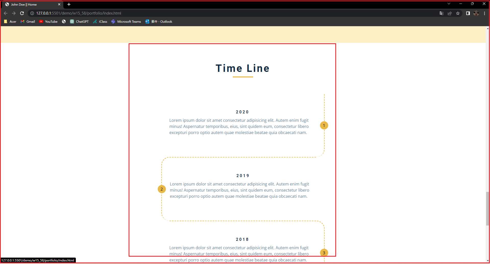
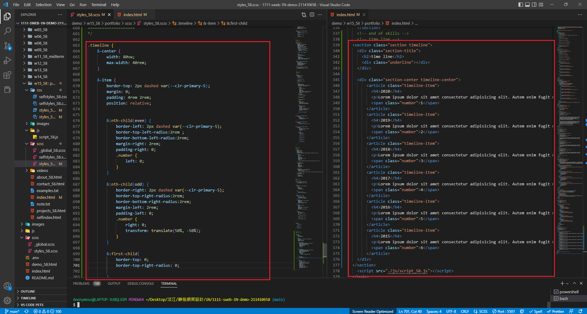
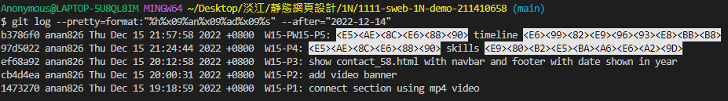

### Github repo url

[My github repo](https://github.com/anan826/1111-sweb-1N-demo-211410658.git)

### W15-P1: connect section using mp4 video



### W15-P2: add video banner



### W15-P3: show contact_58.html with navbar and footer with date shown in year



### W15-P4: 完成 skills 進度條




### W15-P5: 完成 timeline 時間軸




### W15-logs : Week 15 all logs



```
$ git log --pretty=format:"%h%x09%an%x09%ad%x09%s" --after="2022-12-14"
b3786f0 anan826 Thu Dec 15 21:57:58 2022 +0800  W15-PW15-P5: <E5><AE><8C><E6><88><90> timeline <E6><99><82><E9><96><93><E8><BB><B8>
97d5022 anan826 Thu Dec 15 21:24:44 2022 +0800  W15-P4: <E5><AE><8C><E6><88><90> skills <E9><80><B2><E5><BA><A6><E6><A2><9D>
ef68a92 anan826 Thu Dec 15 20:12:58 2022 +0800  W15-P3: show contact_58.html with navbar and footer with date shown in year
cb4d4ea anan826 Thu Dec 15 20:00:31 2022 +0800  W15-P2: add video banner
1473270 anan826 Thu Dec 15 19:18:59 2022 +0800  W15-P1: connect section using mp4 video
```
