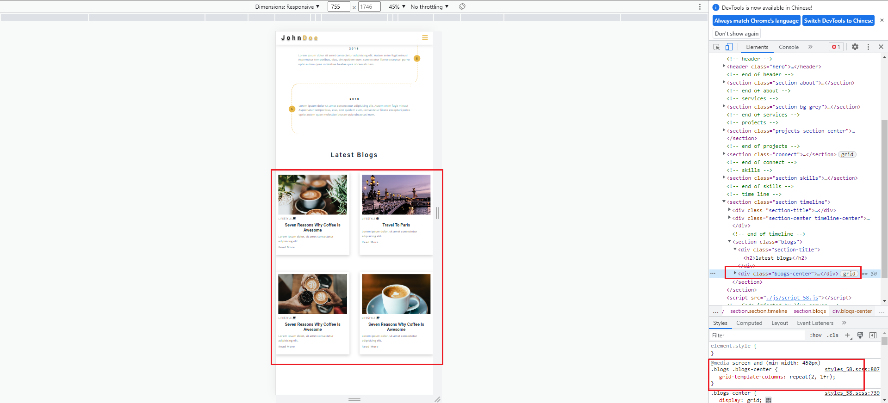
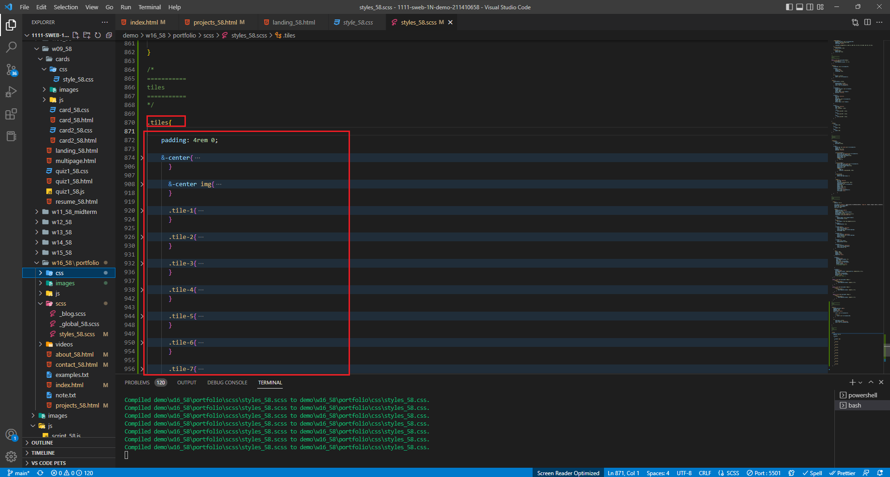
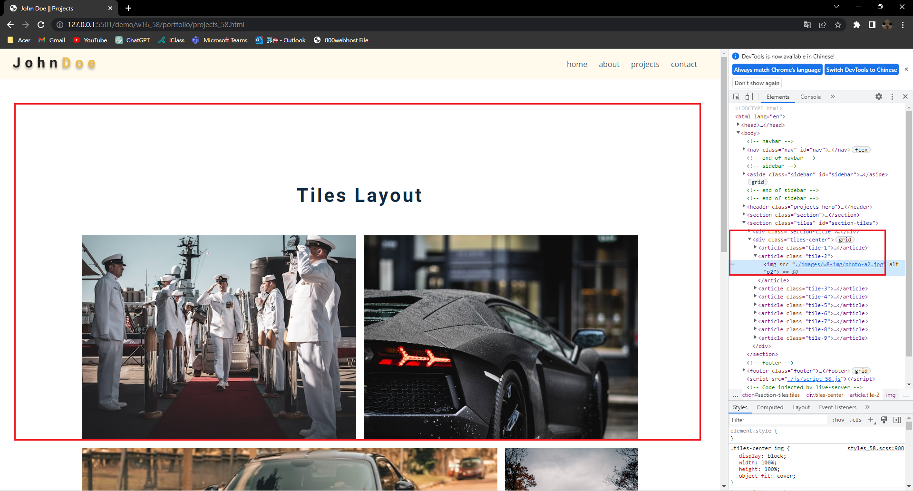
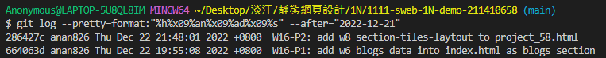

### Github repo url

[My github repo](https://github.com/anan826/1111-sweb-1N-demo-211410658.git)

### W16-P1: add w6 blogs data into index.html as blogs section




### W16-P2: add w8 section-tiles-laytout to project_58.html





### W16-logs : Week 16 all logs



```
$ git log --pretty=format:"%h%x09%an%x09%ad%x09%s" --after="2022-12-21"
286427c anan826 Thu Dec 22 21:48:01 2022 +0800  W16-P2: add w8 section-tiles-laytout to project_58.html
664063d anan826 Thu Dec 22 19:55:08 2022 +0800  W16-P1: add w6 blogs data into index.html as blogs section
```
